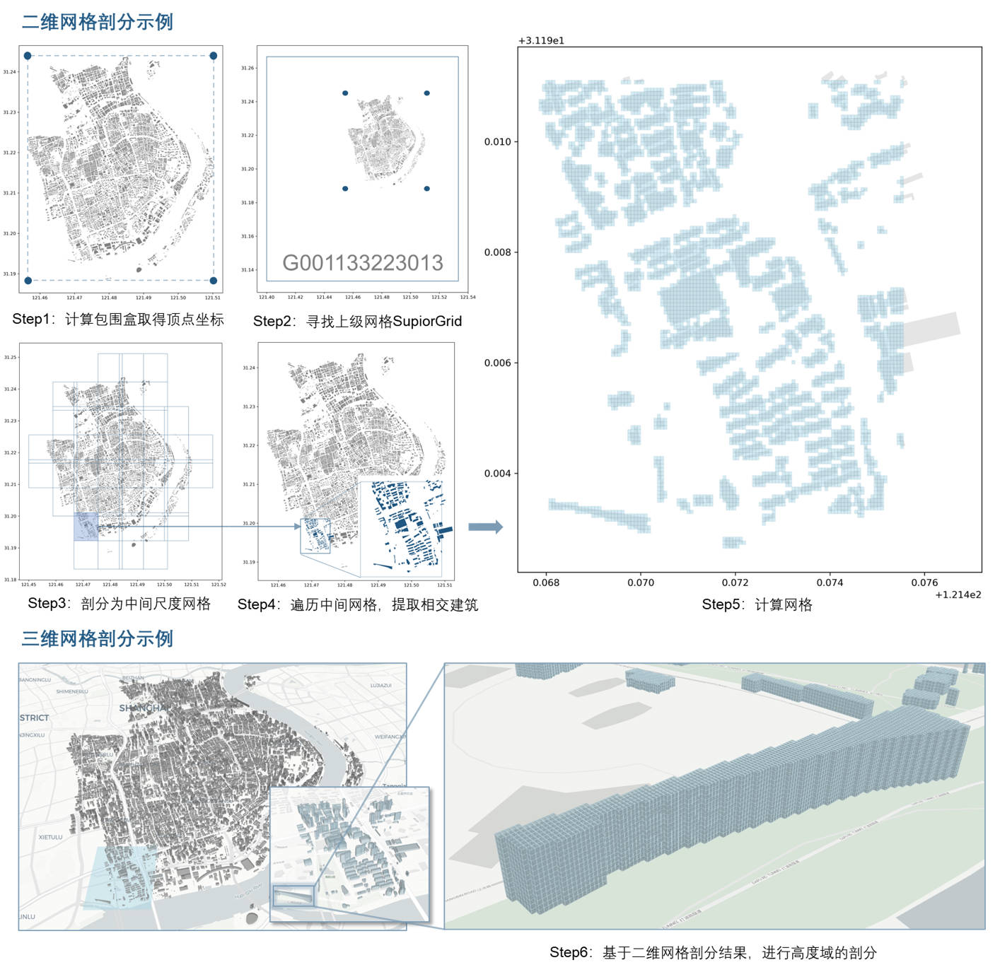

## Gridcode

Gridcode 项目基于 **国标 GBT 40087-2021 《地球空间网格编码规则》** 构建。  
该规则基于 **GeoSOT 地球剖分模型**，将地球空间统一剖分成不同尺度的网格单元，并按统一编码规则进行标识和表达，构建了网格化的地球空间数据组织参考框架。  

本项目实现了 **WGS84 与网格码的相互转换**，以及 **批量数据的高效转换**，可作为地理空间数据网格化管理和分析的基础工具。  

---

### 功能介绍

- **单点转换**  
  - `gridcode.WGS84_to_gridcode(lon, lat, elev, m)`  
  - `gridcode.gridcode_to_WGS84(gridcode, elev_code, m)`  

- **批量转换**  
  - `gridcode.WGS84_to_gridcodes(arr, m, multiprocessing_enabled=True, n_jobs=None)`  
  - `gridcode.gridcodes_to_WGS84(arr, m, multiprocessing_enabled=True, n_jobs=None)`  

---

### 安装与依赖

```bash
# 克隆项目
git clone https://github.com/yourname/gridcode.git

# 安装依赖
pip install -r requirements.txt
```

### 使用示例

单点转换:
```python
from gridcode import *

# 输入经纬度 + 高程
lon, lat, elev, m = 121.5, 31.2, 10.0, 18
grid_code, elev_code = gridcode.WGS84_to_gridcode(lon, lat, elev, m)
print("WGS84 -> gridcode:", grid_code, elev_code)

# 反解
lon2, lat2, elev2 = gridcode.gridcode_to_WGS84(grid_code, elev_code, m)
print("gridcode -> WGS84:", lon2, lat2, elev2)
```

批量转换：
```python
import numpy as np
import gridcode

arr = np.array([
    [121.5, 31.2, 10.0],
    [121.6, 31.3, 20.0]
])

codes = gridcode.WGS84_to_gridcodes(arr, m=18)
print("Batch WGS84 -> gridcodes:", codes)

coords = gridcode.gridcodes_to_WGS84(codes, m=18)
print("Batch gridcodes -> WGS84:", coords)
```

### 后续
后续将开源基础地物数据网格编码功能，敬请期待。

